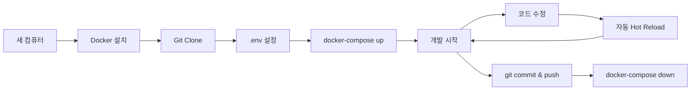

# 🐳 Docker 개발 환경 가이드

## 왜 Docker를 사용하나요?

개발 장소가 바뀌어도 (집 ↔️ 사무실 ↔️ 카페) 동일한 환경에서 작업할 수 있습니다.
- ✅ Node.js 버전 통일
- ✅ 의존성 충돌 방지
- ✅ 팀원과 동일한 환경 공유
- ✅ 새 컴퓨터에서 5분 안에 개발 시작

---

## 📋 사전 준비

### 1. Docker 설치

**Windows:**
1. [Docker Desktop for Windows](https://www.docker.com/products/docker-desktop/) 다운로드
2. 설치 후 재부팅
3. WSL 2 활성화 (자동으로 안내됨)

**Mac:**
```bash
# Homebrew로 설치
brew install --cask docker
```

**Linux:**
```bash
# Ubuntu/Debian
sudo apt-get update
sudo apt-get install docker.io docker-compose
sudo systemctl start docker
sudo systemctl enable docker
```

### 2. 설치 확인
```bash
docker --version
docker-compose --version
```

---

## 🚀 빠른 시작

### 방법 1: Docker Compose 사용 (권장)

```bash
# 1. 프로젝트 클론
git clone https://github.com/saky0504/itsmyturn.git
cd itsmyturn

# 2. 환경변수 파일 생성
cp .env.example .env
# .env 파일 편집 (Supabase URL, API Key 입력)

# 3. Docker 컨테이너 시작
docker-compose up

# 4. 브라우저에서 확인
# http://localhost:3000
```

**백그라운드 실행:**
```bash
docker-compose up -d
```

**로그 확인:**
```bash
docker-compose logs -f app
```

**중지:**
```bash
docker-compose down
```

---

### 방법 2: Dockerfile만 사용

```bash
# 이미지 빌드
docker build -t itsmyturn-app .

# 컨테이너 실행
docker run -p 3000:3000 \
  -v $(pwd):/app \
  -v /app/node_modules \
  -e VITE_SUPABASE_URL=your_url \
  -e VITE_SUPABASE_ANON_KEY=your_key \
  itsmyturn-app
```

---

## 🔄 일상적인 사용법

### 개발 시작
```bash
# 아침에 컴퓨터 켜고
cd itsmyturn
docker-compose up
```

### 코드 수정
- 평소처럼 VSCode나 Cursor에서 코드 편집
- 저장하면 자동으로 Hot Reload 됨 (Vite)
- 브라우저에서 즉시 반영 확인

### 의존성 추가
```bash
# 컨테이너 안에서 명령 실행
docker-compose exec app npm install <package-name>

# 또는 로컬에서 설치 후 재시작
npm install <package-name>
docker-compose restart app
```

### 개발 종료
```bash
# 컨테이너 중지
docker-compose down

# 또는 Ctrl+C
```

---

## 💻 새 컴퓨터에서 시작하기

```bash
# 1. Docker 설치 (위 사전 준비 참고)

# 2. Git에서 코드 받기
git clone https://github.com/saky0504/itsmyturn.git
cd itsmyturn
git checkout migration-complete

# 3. 환경변수 설정
# .env 파일을 만들고 Supabase 정보 입력
# (이전 컴퓨터에서 복사하거나 Supabase 대시보드에서 가져오기)

# 4. Docker Compose로 실행
docker-compose up

# 끝! 5분 안에 개발 환경 완성
```

---

## 🛠️ 유용한 명령어

### 컨테이너 접속
```bash
# Bash 쉘로 접속
docker-compose exec app sh

# 안에서 npm 명령어 실행 가능
npm run build
npm run lint
```

### 완전히 초기화
```bash
# 컨테이너, 이미지, 볼륨 모두 삭제
docker-compose down -v
docker rmi itsmyturn-app

# 다시 빌드
docker-compose up --build
```

### 디스크 공간 정리
```bash
# 사용하지 않는 Docker 리소스 정리
docker system prune -a
```

---

## 📁 파일 구조

```
itsmyturn/
├── Dockerfile              ← Docker 이미지 정의
├── docker-compose.yml      ← 서비스 구성 (앱, DB 등)
├── .dockerignore           ← 제외할 파일 목록
├── .env                    ← 환경변수 (Git에 올리지 말 것!)
└── DOCKER_GUIDE.md         ← 이 문서
```

---

## ⚙️ 환경변수 관리

### .env 파일 (Git에 올리지 마세요!)
```env
VITE_SUPABASE_URL=https://xxxxx.supabase.co
VITE_SUPABASE_ANON_KEY=eyJhbGciOiJIUzI1NiIsInR5cCI6IkpXVCJ9...
```

### 다른 컴퓨터로 옮길 때
1. **비밀번호 관리자 사용** (1Password, Bitwarden 등)
2. **암호화된 USB에 저장**
3. **Supabase 대시보드에서 재발급**

---

## 🐛 문제 해결

### 포트가 이미 사용 중
```bash
# 3000번 포트를 사용하는 프로세스 종료
# Windows
netstat -ano | findstr :3000
taskkill /PID <PID> /F

# Mac/Linux
lsof -ti:3000 | xargs kill -9
```

### 변경사항이 반영되지 않음
```bash
# 컨테이너 재시작
docker-compose restart app

# 캐시 없이 재빌드
docker-compose up --build --force-recreate
```

### "Cannot find module" 에러
```bash
# node_modules 재설치
docker-compose down
docker-compose up --build
```

### Docker Desktop이 느림 (Windows)
1. Docker Desktop → Settings
2. Resources → Memory를 4GB 이상으로 증가
3. WSL 2 Integration 확인

---

## 🌐 Supabase Local 개발 (선택사항)

Supabase도 Docker로 로컬에서 실행하려면:

```bash
# docker-compose.yml에서 supabase-db 주석 해제

# Supabase CLI 설치
npm install -g supabase

# 로컬 Supabase 시작
supabase start

# .env 파일 수정
VITE_SUPABASE_URL=http://localhost:54321
VITE_SUPABASE_ANON_KEY=<로컬 키>
```

---

## 🎯 권장 워크플로우



---

## 📚 추가 자료

- [Docker 공식 문서](https://docs.docker.com/)
- [Docker Compose 가이드](https://docs.docker.com/compose/)
- [Vite Docker 최적화](https://vitejs.dev/guide/backend-integration.html)

---

## ✅ 체크리스트

개발 환경 이동 시:

- [ ] `.env` 파일 백업 (암호화해서 저장)
- [ ] Git에 모든 변경사항 커밋 & 푸시
- [ ] 새 컴퓨터에 Docker 설치
- [ ] `git clone` 후 `docker-compose up`
- [ ] 브라우저에서 localhost:3000 확인
- [ ] 정상 작동 확인 후 개발 재개

---

**이제 어디서든 5분 안에 개발을 시작할 수 있습니다! 🚀**

